# efmesh

> Трансформация данных в духе [sqlmesh](https://sqlmesh.com) — на TypeScript, [Bun](https://bun.sh) и [Effect](https://effect.website).

*Русское зеркало; основной README — [английский](./README.md).*

[](https://github.com/avytheone/efmesh/actions/workflows/ci.yml)     

Модели — обычные TypeScript-модули: тело на SQL, ссылки между моделями — импорты, форма данных — Effect Schema. efmesh считает fingerprint каждой модели по каноническому AST, хранит версии снапшотами, строит план как diff «проект против окружения» и применяет ровно его: физика пересчитывается только там, где что-то реально изменилось, а окружения (dev/prod/…) — виртуальные view поверх общей физики, промоушен в prod не стоит ни одного пересчёта.

<p align="center"></p>

```ts
import { Schema } from "effect"
import { defineModel, kind } from "@avytheone/efmesh"
import { rawMoves } from "./sources.ts"

export const moves = defineModel(
  {
    name: "med.moves",
    kind: kind.incrementalByTimeRange({
      timeColumn: "moved_at",
      start: "2026-01-01T00:00:00Z",
      lookback: 1, // хвост перечитывается — поздние данные подъезжают
    }),
    schema: Schema.Struct({ case_id: Schema.String, moved_at: Schema.DateTimeUtc }),
  },
  (ctx) => ctx.sql`
    SELECT ${ctx.cols(rawMoves, "case_id", "moved_at")}
    FROM ${ctx.ref(rawMoves)}
    WHERE moved_at >= ${ctx.start} AND moved_at < ${ctx.end}
  `,
)
```

## Почему не dbt / sqlmesh

|                        | dbt                   | sqlmesh                 | efmesh |
|------------------------|-----------------------|-------------------------|--------|
| Язык моделей           | SQL + Jinja           | SQL + Jinja/Python      | SQL внутри TypeScript |
| Зависимости            | `ref('строка')`       | парсинг SQL             | импорт модуля — проверяет компилятор |
| Типизация колонок      | нет                   | contracts (рантайм)     | Effect Schema: компайл-тайм + контракт перед сборкой |
| Версионирование        | нет (state-less)      | снапшоты + fingerprint  | снапшоты + fingerprint |
| Dev-окружения          | копии таблиц          | виртуальные (view)      | виртуальные (view) |
| Инкрементальность      | самописный `is_incremental()` | интервалы, автоучёт | интервалы, автоучёт, resume |
| Озеро на parquet       | адаптеры              | адаптеры                | родное: `target: "parquet"`, интервал = партиция |
| Мульти-диалект         | да                    | да (sqlglot)            | **нет** — диалект движка (DuckDB или Postgres) |

Опечатка в `ref` у нас — ошибка компиляции, а не пустой прогон; переименованная колонка родителя ломает сборку потомка до того, как SQL уедет в базу.

## Для кого это (и для кого нет)

**Для вас**, если вы TypeScript-команда на Bun, хотите типизированный
dbt/sqlmesh-подход поверх DuckDB или Postgres и готовы жить на бете
(efmesh — 0.1.x, Effect v4 — beta, версия effect пинована peer-зависимостью).

**Не для вас**, если нужны: Node-рантайм (пока только Bun), мульти-диалект
или облачные DWH (Snowflake/BigQuery — вне scope), стабильность уровня 1.0
или Python-экосистема — тогда честнее взять sqlmesh.

## Возможности

**Модели.** `full`, `view`, `embedded` (подзапрос без материализации), `incrementalByTimeRange` (интервальный учёт, бэкфилл батчами, lookback), `incrementalByUniqueKey` (upsert), `scdType2` (история строк, `valid_from`/`valid_to` ведёт efmesh), `defineExternal` (таблица, файлы parquet/csv/json, URL), `defineSeed` (справочник из CSV/JSON, содержимое в fingerprint), `defineSqlModel` (сырой `.sql`-файл с `@ref`/`@start`/`@end`).

**Цели материализации.** Нативная таблица движка, `parquet` (озеро: локально или s3://, интервал = партиция, view поверх `read_parquet`), `ducklake` (таблица-на-fingerprint в [DuckLake](https://ducklake.select)-каталоге — снапшоты и time travel каталога бонусом).

**План и версии.** Fingerprint по каноническому AST (переформатирование SQL не триггерит пересборку), категоризация изменений breaking / non-breaking / indirect / forward-only, `--forward-only` — правка без переигрывания истории (новая версия наследует физику и done-интервалы, новые колонки — `ALTER`), подтверждение плана в TTY, журнал применений с `applied_by`.

**Качество.** Контракт схемы перед сборкой (`DESCRIBE` запроса против объявленной Schema), аудиты `notNull` / `unique` / `accepted` (blocking роняет apply, `warn` — логирует), автономный `efmesh audit` по view-слою окружения, `testModel` — юнит-тесты моделей на фикстурах в in-memory DuckDB.

**Эксплуатация.** `run` — идемпотентный тик планировщика для cron/systemd; `apply` и `run` окружения — под одним межпроцессным локом (протухший лок упавшего процесса перехватывается по ttl); DAG-конкурентность `--jobs` (модель стартует по готовности родителей); ретраи батчей `--retries`; janitor для осиротевшей физики (снос — транзакционный claim, гонка с параллельным apply закрыта); Metric-счётчики и спаны на операциях; версионируемая схема state store + `efmesh migrate` (с бэкапом файла стора).

**Движки.** DuckDB (по умолчанию, включая федерацию httpfs/ATTACH) и Postgres (`Bun.SQL`-пул, canonicalize через libpg_query, параллельный бэкфилл). State store — SQLite рядом с проектом или схема в Postgres.

## Быстрый старт

```sh
bun add -d @avytheone/efmesh@beta
bunx efmesh init my-warehouse && cd my-warehouse
bunx efmesh plan dev    # что будет сделано
bunx efmesh apply dev   # физика, бэкфилл, view-слой
```

`init` разворачивает рабочий скелет: `efmesh.config.ts`, модели-пример, seed. Дальше — правьте модели и гоняйте `plan`/`apply`; полный жизненный цикл:

```sh
bunx efmesh apply dev            # применить изменения в dev
bunx efmesh audit dev            # аудиты того, что окружение отдаёт сейчас
bunx efmesh apply prod --yes     # промоушен: view-swap, без пересчёта
bunx efmesh run prod             # cron-тик: догнать новые интервалы
```

Живой пример: [examples/hospital](./examples/hospital/) — движения пациентов по отделениям, все виды моделей и целей.

## Как это устроено

```
модели (TS-модули)  ──►  DAG + fingerprint по каноническому AST
                              │
                    план = diff против state store
                              │
        apply: физика ── бэкфилл интервалов ── аудиты ── view-слой
                              │
              state store: снапшоты, интервалы, окружения, журнал
```

- **Физический слой** — таблицы `_efmesh.<модель>__<fp8>` (или parquet-префиксы/DuckLake): версия = таблица, старая живёт до janitor.
- **Виртуальный слой** — view `<env>__<schema>.<таблица>` (prod — просто `<schema>.<таблица>`), указывающие на физику. Окружение — это набор указателей; промоушен и откат — переключение view.
- **Учёт интервалов** — единственный источник правды о посчитанном: упавший бэкфилл продолжается с места остановки, пересчёт интервала — DELETE+INSERT диапазона в транзакции, без дублей.

Полная архитектура, инварианты и решения — в [SPEC.md](./SPEC.md).

## Качество данных

```ts
// аудит: SQL-предикат нарушений; blocking роняет apply, warn — логирует
audits: [
  audit.notNull("case_id"),
  audit.unique("case_id", "moved_at"),
  audit.warn(audit.accepted("dept", ["КПП", "ОРИТ", "терапия", "хирургия"])),
]
```

```ts
// юнит-тест модели: фикстуры → CTE → in-memory DuckDB → сверка (bun test)
import { testModel } from "@avytheone/efmesh/testing"

test("stays", () =>
  testModel(stays, {
    inputs: { [moves.name.full]: [{ case_id: "c1", moved_at: "2026-01-01T10:00:00Z" }] },
    expect: [{ case_id: "c1", duration: null }],
  }))
```

Объявленная `schema` — не документация, а контракт: перед сборкой efmesh делает `DESCRIBE` запроса и падает с `SchemaMismatchError`, если имена или типы колонок разошлись. NULL-гарантии выражаются аудитом `notNull`.

## Конфигурация

`efmesh.config.ts` — типизированный TS-модуль, никакого YAML:

```ts
import { defineConfig } from "@avytheone/efmesh"

export default defineConfig({
  discovery: "models/**/*.ts",      // все экспорты-модели по glob; дубликат имени = ошибка
  // models: [a, b, c],             // …или значениями (можно совместно с discovery)

  // движок: DuckDB-файл по умолчанию, Postgres — одной строкой
  engine: { path: "efmesh.duckdb" },          // или { url: "postgres://…", max: 8 }
  state: { path: "efmesh.state.sqlite" },     // или { url: "postgres://…" }

  lake: { path: "lake" },                     // для target: "parquet"; локально или s3://
  ducklake: { catalog: "ducklake.sqlite", dataPath: "lake/ducklake" },
  attach: { reporting: { url: "reporting.duckdb" } },  // export-цели по алиасам
})
```

## CLI

| Команда | Что делает |
|---|---|
| `efmesh init [dir]` | скаффолд проекта: конфиг, модели-пример, seed |
| `efmesh plan <env>` | diff проекта против окружения + недостающие интервалы, ничего не меняет |
| `efmesh apply <env>` | план → подтверждение (TTY) → физика, бэкфилл, view-слой |
| `efmesh run <env>` | тик планировщика: только новые интервалы, под локом; для cron |
| `efmesh audit <env>` | аудиты view-слоя окружения — ловит деградацию задним числом |
| `efmesh diff <envA> <envB>` | чем окружения отличаются |
| `efmesh render <model> [--env]` | итоговый SQL модели |
| `efmesh lineage <model[.col]>` | колоночный lineage до сырья |
| `efmesh graph [--html]` | DAG моделей текстом или страницей |
| `efmesh janitor [--ttl 7]` | снести осиротевшую физику старше ttl |
| `efmesh migrate` | догнать схему state store до текущей версии |

Флаги `apply`/`run`: `--jobs N` — DAG-конкурентность (на DuckDB всегда 1 — одно соединение), `--retries N` — ретраи транзиентных сбоев батча (экспоненциальная пауза), `--yes`/`-y` — без подтверждения, `--forward-only <model>,…` — реюз физики и истории.

Exit-коды: `0` — успех, `1` — ошибка, `2` — «ждёт человека»: план требует
подтверждения в не-TTY (нужен `--yes`) или `run` упёрся в неприменённые
изменения. В не-TTY `apply` с изменениями БЕЗ `--yes` не применяется —
молча катить план, который никто не видел, efmesh отказывается.

## Postgres

```ts
engine: { url: "postgres://…" },  // canonicalize через libpg_query
state:  { url: "postgres://…" },  // схема efmesh_state
```

Бэкфилл гонит батчи параллельно (пул соединений), независимые ветки DAG строятся одновременно. DuckDB-федерация (seed, parquet, external-файлы, export, ducklake) на Postgres честно падает `EngineFeatureError` — без тихой деградации.

## Статус

**0.1.0-beta.1.** Ядро построено и прогнано на живом примере: фазы F0–F6 (см. [SPEC.md §13](./SPEC.md) и [CHANGELOG](./CHANGELOG.md)), 138 тестов, включая живой Postgres-кластер и golden-тесты стабильности fingerprint. Effect v4 — beta-зависимость: пинована точно (peerDependencies), дрейф свежих бет ловит еженедельный CI.

Дальше по спеке: override категоризации в диалоге плана, интервалы не по времени. Известное ограничение: одиночный бинарник `bun build --compile` собирается, но standalone-исполняемые Bun не резолвят импорт `"efmesh"` из рантайм-конфига — дистрибуция пакетом (SPEC §10).

## Документация

- [SPEC.md](./SPEC.md) — архитектурная спецификация: решения, инварианты, открытые вопросы;
- [CHANGELOG.md](./CHANGELOG.md) — история изменений;
- [examples/hospital](./examples/hospital/) — живой пример со всеми видами моделей;
- [CONTRIBUTING.md](./CONTRIBUTING.md) — как собрать, погонять тесты и предложить правку.

## Лицензия

[MIT](./LICENSE) © Alexey Yakimanskiy
